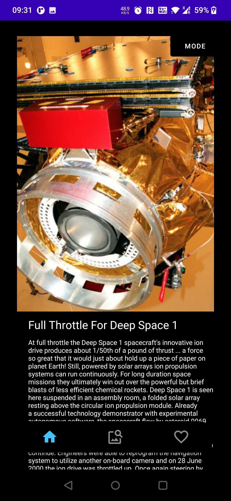
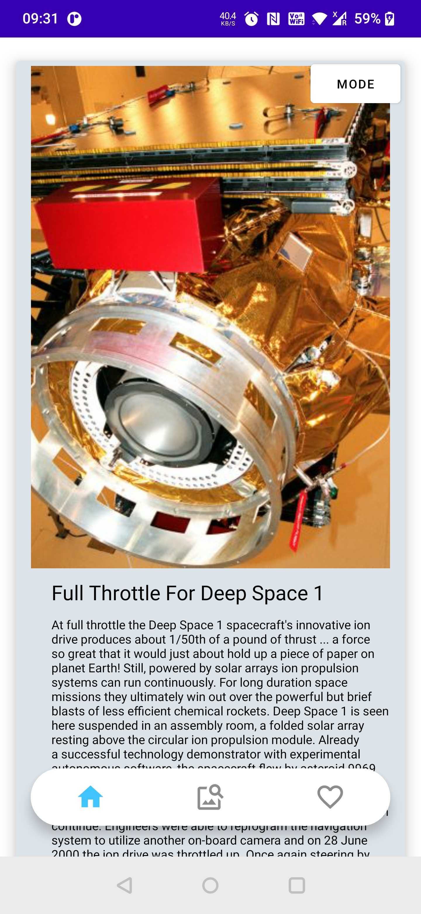
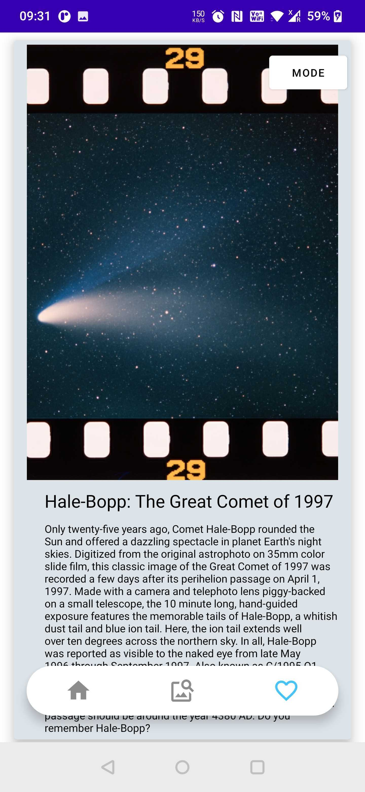
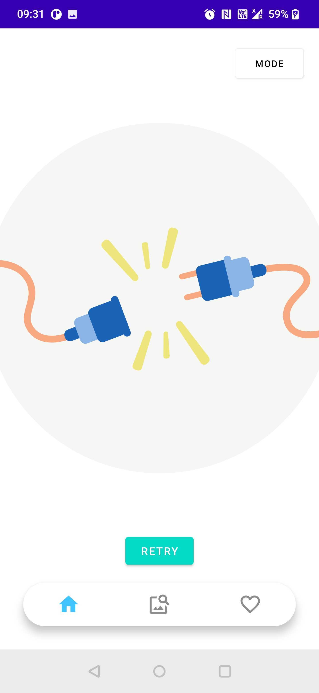
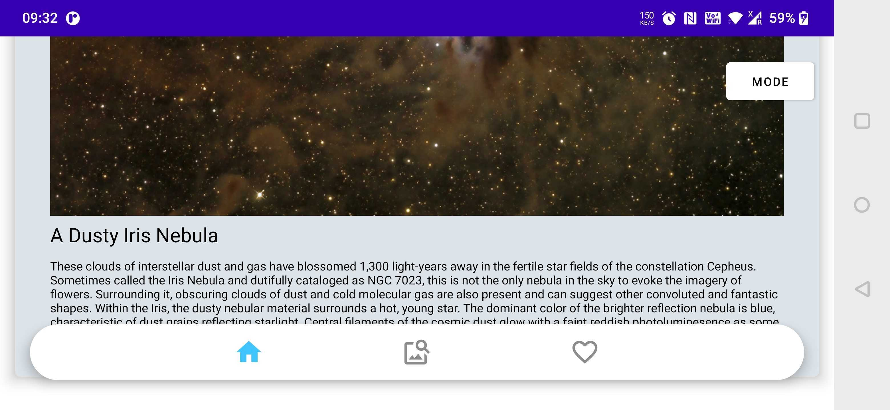
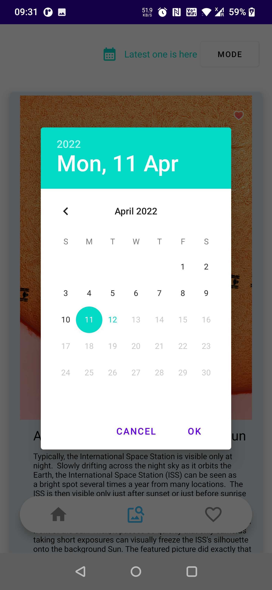

# nasa_apod
Consumes NASA's API to show the Astronomy Picture of a specific date or date range
The app has 3 fragments. First fragment hits an API to get random 10 APOD items
Second fragment gets today's APOD by default. User can search by date using calendar.
Third fragment is all the APODs saved in local DB. Any APOD is added to lcoal DB if user clicks on favourites icon in second fragment. 

If a APOD is already present in local DB, it's favourite state is updated in second fragment too.
A no internet screen and orientation handling are developed. 

There is a dark_mode/light_mode button on activity level. 

Used Single Activity with MVVM architecture. With a SharedViewModel between 3 fragments. 
Room DB, Coroutines, ViewModels, Retrofit, Lottie, Bottom NavigationView, RecyclerView, Calendar were used during the development so far.
Just checkout the code and run the app. No additional set up is required.

